## 定义

操作系统是位于硬件层(HAL)之上，所有其它系统软件层之下的一个系统软件。

其主要作用是`管理`好这些设备，提高它们的利用率和系统的`吞吐量`，并为用户和应用程序提供一个统一的`接口`，便于用户使用。


## 基本特征

- 并发

`并发`是指宏观上在一段时间内能同时运行多个程序，而并行则指同一时刻能运行多个指令。

`并行`需要硬件支持，如多流水线或者多处理器。

`操作系统`通过引入`进程和线程`，使得程序能够`并发`运行。


- 共享

共享是指系统中的资源可以被多个并发进程共同使用。有两种共享方式：`互斥共享`和`同时共享`。

**互斥共享**的资源称为`临界资源`，例如打印机等，需要用`同步机制`来实现对临界资源的访问。

- 虚拟
  - 时分复用技术：多个进程能在同一个处理器上并发执行。
  - 空分复用技术：`虚拟内存`将物理内存抽象为`地址空间`，每个进程都有各自的地址空间。地址空间的页被映射到物理内存，地址空间的页并不需要全部在物理内存中，当使用到一个没有在物理内存的页时，执行`页面置换算法`，将该页置换到内存中。

- 异步

异步指进程不是一次性执行完毕，**而是走走停停，以不可知的速度向前推进。**

> **UNIX**操作系统的根本特点：**分时多用户【并发】、开放性【标准化 、可移植性 可互操作性】**

## 基本功能

- 进程管理

进程控制、进程同步、进程通信、死锁处理、处理机调度等。

- 内存管理

内存分配、地址映射、内存保护与共享、虚拟内存等。

- 文件管理

文件存储空间的管理、目录管理、文件读写管理和保护等。

- 设备管理

完成用户的 I/O 请求，方便用户使用各种设备，并提高设备的利用率。

主要包括缓冲管理、设备分配、设备处理、虛拟设备等。

- 时钟管理

 分时共享cpu，时间片，调度。

- 操作系统与用户之间的接口

- 实现对计算机资源抽象

## 进程/文件

> **进程和文件是UNIX操作系统中最基本的两个概念（抽象）**

进程：**一个进程就是处在运行期间的一个程序实例。涵盖所有的动态概念。**

文件：**所有静态的无形数据和有形硬件设备：源程序、命令、图片、邮件、 打印机、内存、磁盘等。**

### 1. 文件系统

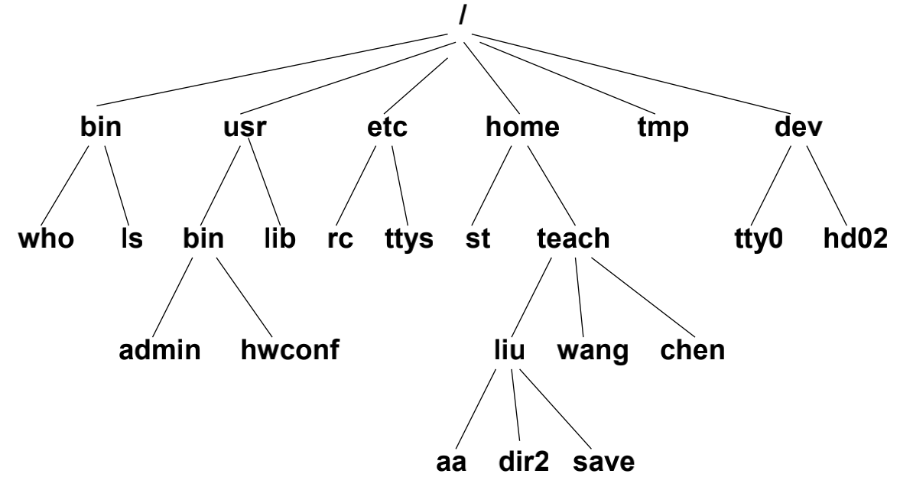

- 树状层次结构：**树根、树枝、树叶、路径**

- 对文件数据的一致对待：**文件为有序无格式的字节流，逻辑意义由使用者解释。**

- 文件管理：

  - 建立、删除、修改、备份、移动、替换 **——** **上层操作**

  - **存储空间的分配和释放** **——** **下层操作**

- 文件的访问和保护：**索引节点、文件描述符(fd)、用户分组、权限划分**

- 设备文件管理：**统一各外部设备的访问模式。**

#### （1）索引节点（inode）

- **文件的内部名称（或代号），方便机器操作；**

-  **每个文件都有一个且只有一个inode与之对应；**

-  **inode存放文件的静态参数：存放地点、所有者、文件类型、存取权限、文件大小等；**

- **每个文件都可以有多个名字，但都映射到同一个inode上；**

- **各inode之间以inode号相区别；**

#### （2）**链结（link）—— ln**

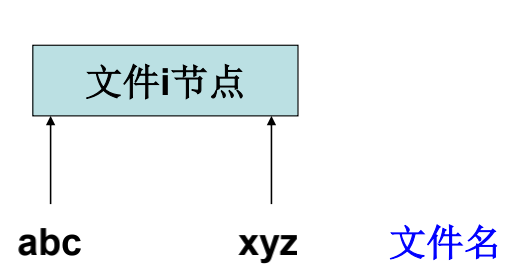

- 一个文件可有多个名字，多个名字都对应同一个文件i节点，每个名字就是该文件节点的一个链结；
- 一个普通文件的名字个数，就是该文件的链结数；
- 每个链接名可以放在不同的目录下（同一个文件系统下）；
-  删除一个链接名时，文件链接数减一。如链接数不为零，则文件（节点）仍然存在。

> - 方便用户的使用习惯，如“列目录”，可用ls、dir 、list、lc等；
> - 误删文件时可补救，又不多占空间。abc和xyz具有相同的i结点号；
> - 减少移植应用程序时，因使用指定位置的文件，而拷贝该文件到指定位置去的麻烦。

#### （3）符号链结（symbol link）—— ln -s

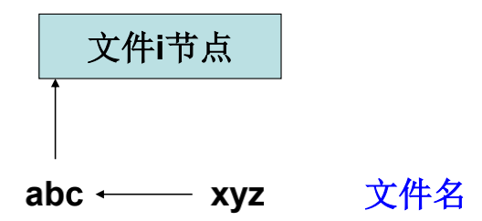

- 给文件的名字再取一个名字，而不是给文件节点再取一个名字。
- 链接的是“符号”而不是文件，因此“符号”可以是不存在的文件，即无意义的字符串。
- abc和xyz具有不同的inode号，xyz的内容是它所指向的名字的字符串，大小是字符串长度为3字节。
-  “普通链结”中各名字必须在同一文件系统中，“符号链结” 可在不同的文件系统中。 

#### （4）活动i节点表（索引节点表inode表）

**在内存中存放当前要使用的文件inode的表（或称为活动i节点表），表中的每一个表项对应一个当前正被使用的文件的状态信息。这样要使用（打开）同一个文件的进程不必再到盘上去寻找了（共享！）**

#### （5）用户打开文件表（用户文件描述符表）

在系统中每一个进程都有一个**描述该进程的数据结构user（类似于描述文件的i节点）**。在user中有一个数组，存放一组指针**指向系统打开文件表中该进程打开的文件所对应的表项**。

struct file *u_ofile[NOFILE] ；NOFILE 为每个进程最多可同时打开的文件数，这与系统中的进程数和内存大小以及交换区大小等有关系，一般为20~100。这个u_ofile数组就是该进程的用户打开文件表。

#### （6）系统打开文件表（file表）

**系统打开文件表主要存放被打开文件的读写指针。**因为一个进程在一个时间片内可能读写不完所需内容，需要在下一个时间片继续从上一个时间片结束时的读写位置开始读写，故在进程生存期间应保持一读写指针。此外file表中还存放被打开文件的动态信息：如文件状态、引用计数（当前使用该文件的进程数）等。

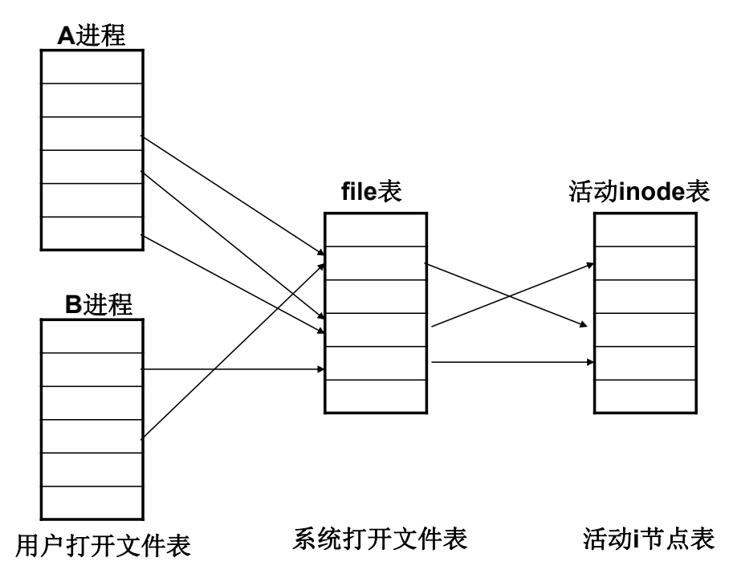

> - **为什么要单独设立一个file表来存放读写指针呢？**
>   **由于可能有多个进程要共享一个被打开文件的inode，而每个进程的读写指针都不相同，故不能
>   放在inode表中。另一方面，要使不同进程的打开文件指针（文件描述符）或同一进程的不同打开文件指针能够共享一个打开文件指针（协同操作），就不能把读写指针放进某一个进程的用户打开文件表中。因此只能在用户打开文件表和活动inode表之外再建立一个系统打开文件表（file表）来存放读写指针。**
>
>   
>
> - **UNIX操作系统中共享活动文件的方法：**
>   在内存中某个活动文件的副本只有一个，不同的进程采用不同的指针指向这文件的副本。由于任一时刻只有一个进程在运行（微观上看），故该文件也只要求内存中有一个副本即可，只是各个进程有自己的读写指针而已。这是在UNIX系统中共享文件（包括用户文件和系统文件）的主要方法。对其它资源的共享采用的是与之相似的另外几种方法。

### 2. 程序

> **程序：可执行的文件**
>
> 进程是可执行文件的一次执行实例，高级语言程序经过编译或汇编语言程序经过汇编后所产生的、缺省名为a.out的可执行文件的结构包括图示四个部分：

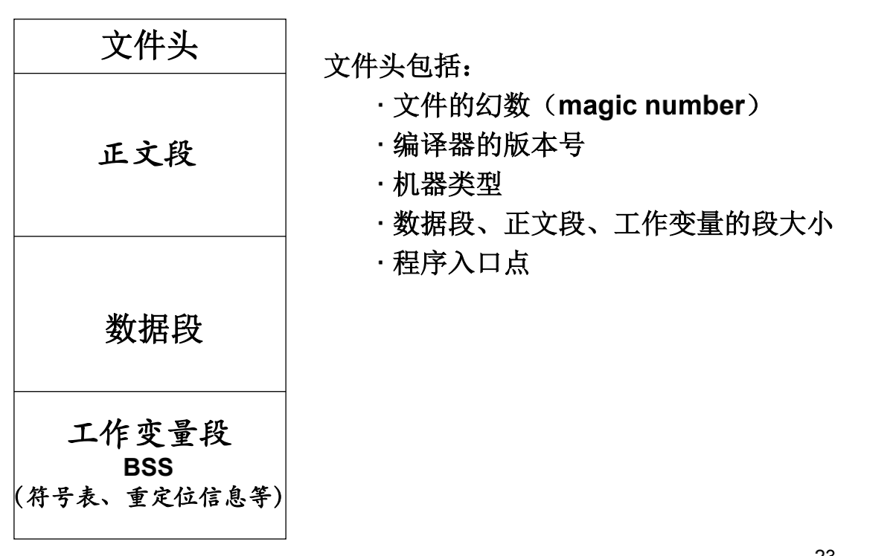

- **程序的执行**

  一个进程在执行系统调用exec时，把可执行文件装入本进程的三个区域中：

  - 正文区：对应可执行文件的正文段
  - 数据区：对应可执行文件的数据标识段
  - 堆栈区：新建立的进程工作区；堆栈主要用于传递参数，保护现场，存放返回地址以及为局部动态变量提供存储区。

> **堆栈使用举例：如下程序在主程序中调用函数，并进行参数传递：**
>
> ```c
> main (int argc, char *argv[ ])
> {
> char buf[1024];
> int number;
> readfile (buf, number);
> }
> 
> readfile (char buffer[ ], int line)
> {
> char *pointer;
> int temp;
> }
> ```
>
> 用户栈------>执行main------->调用readfile
>
> 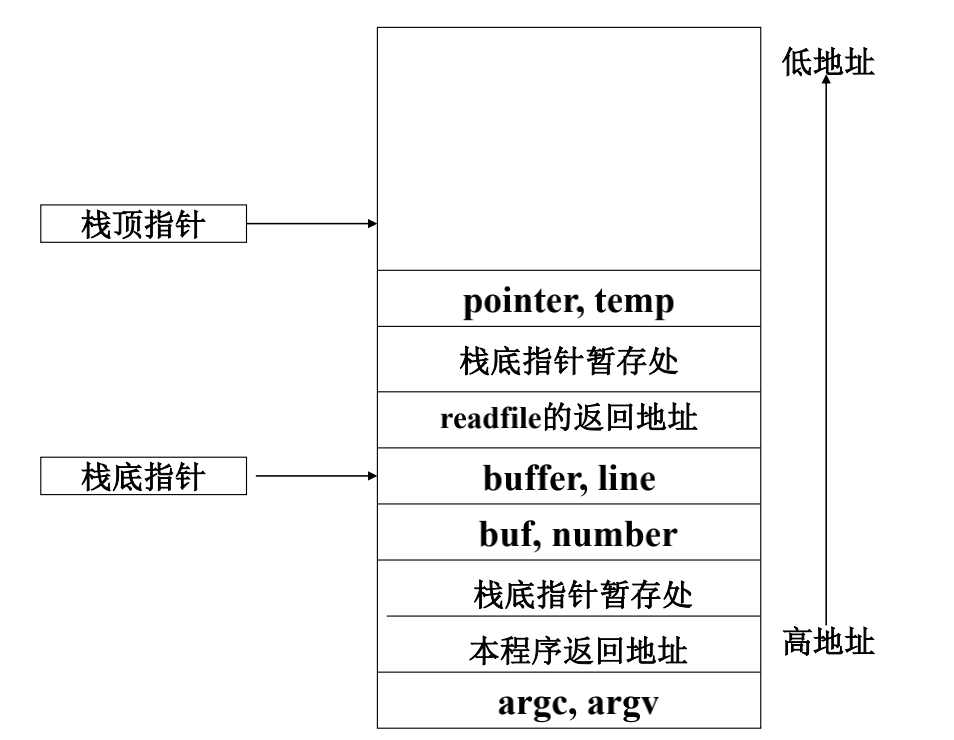

### 3. 进程

> **程序的一次执行实例。**
>
> **一个程序可同时有多个实例；系统中可同时有多个进程**

- **父进程：调用系统调用fork的进程**

- **子进程：由系统调用fork产生的新进程**

- **执行程序：调用execl,用被执行程序的内容覆盖本进程地址空间**

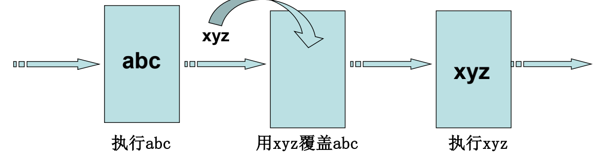

>  **0#进程：是由机器上电时“手工”创建的，调用fork创建了1#进程后，成为对换进程（swap）。**
>  **1#进程：init进程，由它来创建系统初始化过程中所需的其它所有的进程。**
>
>  **除0#进程外，其它所有进程都是另一个进程调用fork后产生的。**

## 系统调用/内核

### 1. 系统调用

如果一个进程在`用户态`需要使用`内核态`的功能，就进行`系统调用`从而陷入内核，由`操作系统`代为完成。Linux 的系统调用主要有以下这些: fork(); exit(); wait();等。

**以函数形式提供给核外的命令和上层应用系统使用的一组程序，涵盖操作系统的所有功能。是应用程序请求操作。系统服务的唯一通道。**

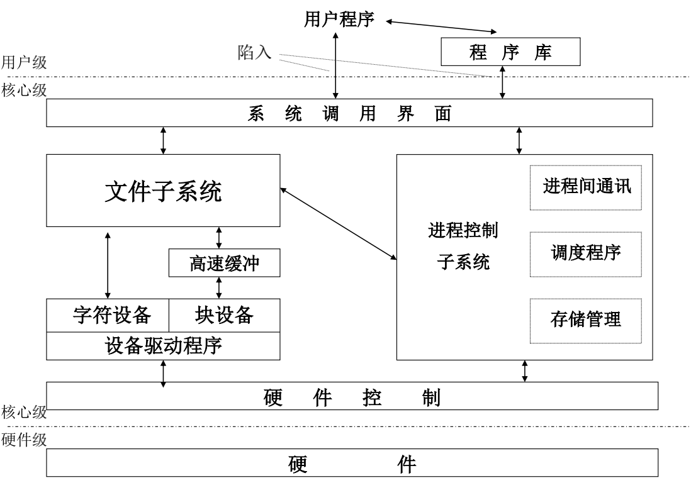

>特权级别：**最关键的工作必须交给特权级最高的进程去执行，这样可以做到集中管理**，减少有限资源的访问和使用冲突。inter x86架构的cpu一共有四个级别，`0-3级，0级特权级最高，3级特权级最低。`
>
>大部分用户直接面对的程序都是运行在`用户态`。`Ring3`状态不能访问Ring0的`地址空间`，包括`代码和数据`。
>
>当一个进程因为系统调用陷入内核代码中执行时处于内核运行态（内核态）此时特权级最高，为0级。执行的内核代码会使用当前进程的内核栈，`每个进程都有自己的内核栈`。
>
>`权力的不同`:用户态的程序就**不能随意操作内核地址空间，具有一定的`安全保护作用`。**

首先内核态和用户态的`堆和栈`是不一样的，所以必然会发生`寄存器状态的切换`。

- 当一个进程执行`系统调用`而陷入内核代码中执行时，我们就称进程处于内核态。

- 当进程在执行用户自己的代码时，则称其处于用户态。

linux 进程有 4GB 地址空间，如图所示3G-4G 大部分是`共享的，是内核态的地址空间`。这里存放整个`内核的代码`和所有的内核模块以及内核所维护的`数据`。

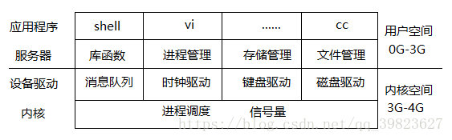

从**用户态到内核态**可通过以下方式

- `系统调用（陷入）`：**这是用户态进程`主动`要求切换到内核态的一种方式**，**用户态进程通过系统调用申请使用操作系统提供的服务程序完成工作。**其核心还是使用了操作系统为用户特别开放的一个`中断`来实现。
- `异常`：CPU在执行运行在用户态下的程序时，发生了某些事先不可知的异常，**这时会触发由当前运行进程切换到处理此异常的内核相关程序中**，也就转到了内核态，比如`缺页异常`。
- `外围设备的中断`：**当外围设备完成用户请求的操作后，会向CPU发出相应的中断信号**，这时CPU会暂停执行下一条即将要执行的指令转而去执行与中断信号对应的处理程序，

> 处于用户态执行时，进程所能访问的内存空间和对象受到限制，其所处于占有的处理器是可被抢占的。
>
> 处于内核态执行时，则能访问所有的内存空间和对象，且所占有的处理器是不允许被抢占的。

### 2. 内核

> 内核：**系统调用的集合及实现系统调用的内部算法就形成操作系统核心**
>
> **`内核一定常驻在内存`**

- 大内核

大内核是将操作系统功能作为一个**紧密结合的整体放到内核**。由于各模块共享信息，因此有很高的性能。

- 微内核

为降低内核的复杂性，将一部分操作系统功能移出内核，移出的部分根据分层的原则划分成若干服务，`相互独立`。

在微内核结构下，操作系统被划分成定义良好的模块，只有**微内核这个模块运行在内核态，其余运行在用户态。**

因为需要频繁地在用户态和核心态之间进行切换，所以会有一定的`性能损失`。

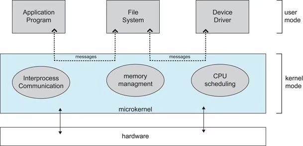

> **微内核相当于一个信息交换中心，自身可以实现的功能较少，主要职责是传递一个请求，一个A模块对其他模块功能的请求。而大内核相当于一个是一个中央集权控制中心，把内存管理，文件管理等功能全部管理。**

## 中断

### 1. 外中断

由`CPU 执行指令以外的事件`引起，如 I/O 完成中断，表示设备输入/输出处理已经完成，处理器能够发送下一个输入/输出请求。此外还有时钟中断、控制台中断等。

### 2. 异常

由 CPU 执行指令的内部事件引起，如`非法操作码、地址越界、算术溢出`等。

### 3. 陷入

在用户程序中使用系统调用。

| 类型     | 源头                     | 响应方式   | 处理机制                             |
| -------- | ------------------------ | ---------- | ------------------------------------ |
| 中断     | 外设                     | 异步       | 持续，对用户应用程序是透明的         |
| 异常     | 应用程序意想不到的行为   | 同步       | 杀死或重新执行意想不到的应用程序指令 |
| 系统调用 | 应用程序请求操作提供服务 | 异步或同步 | 等待和持续                           |

> 中断级别
>
> **用一组特权指令给处理机设置一个执行级，以屏蔽同级和低级的中断，最大限度地减少其它事件的干扰，使当前任务顺利执行并尽快完成；但开放更高级的中断，以响应更紧迫的请求。**

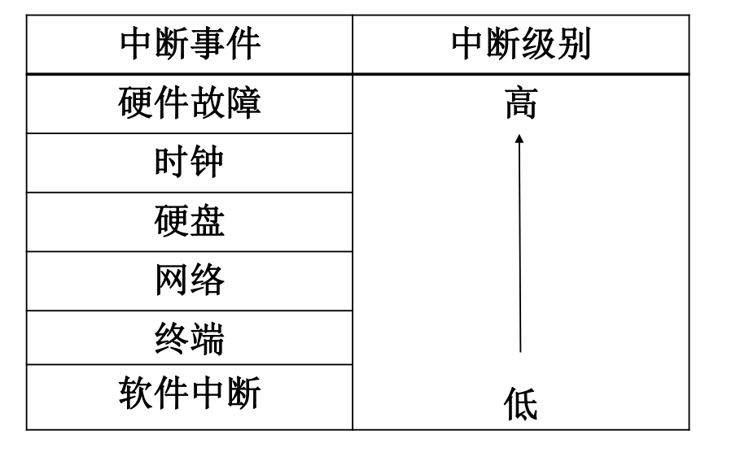

## 存储

- **当前正在执行的进程（全部或部分）驻留在主存中；**

- **核心是永远驻留在主存中的（是永远活动的！）；**

- 编译程序产生的指令地址是虚地址（逻辑地址）；

- 程序运行时核心与硬件（存储管理部件MMU）一起建立虚地址到物理地址的映射。

>  **核心永远是活跃的。普通进程具有特定的生命周期（除非人为设定为无限循环）**
>
> **只是用户进程中的核心态下运行的代码段常驻内存，而非整个用户进程常驻内存。这些代码段是“可再入段”（或纯代码段、可共享代码段），被各用户进程段共享，为提高运行速度，避免频烦访问磁盘，故常驻内存，这些代码段的集合就是OS的内核。**
>
> 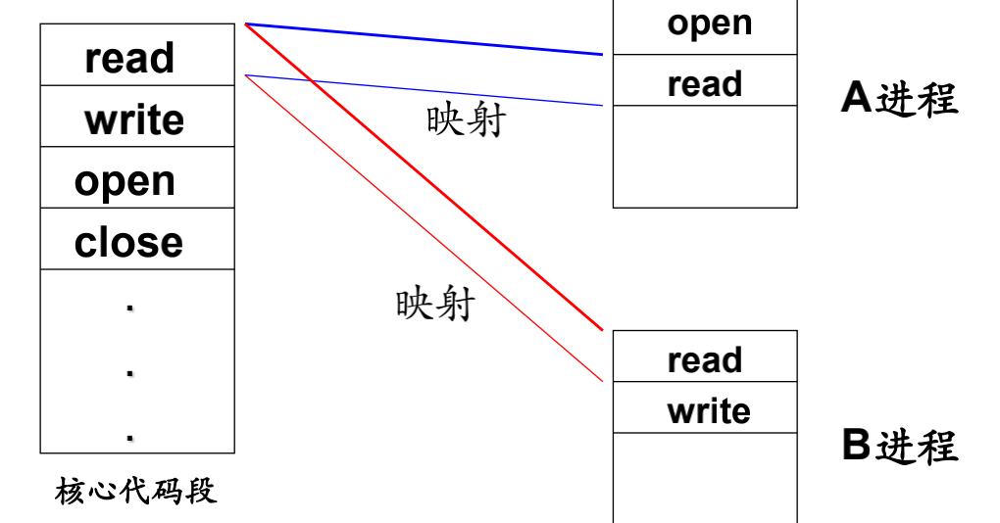

## 堆栈/堆

在32位系统，内存的寻址可以达到4G。 理论上，用户可以使用一个32位（四字节）的指针访问任意内存地址。在编程中我们却常常会遇到`segment fault`错误，指示我们`非法内存访问`，有些位置我们是无权访问的，或者说暂时无权访问，只有申请了该内存才能访问。

大多数操作系统会把4G的内存空间进行划分，比如**linux通常会默认把高地址的1G空间分配给内核（内核空间给内核线程执行特权操作，比如维护打开文件表等），剩余的作为内存空间。**内存空间又大致分为`堆空间`，`栈空间`，`代码区`等。

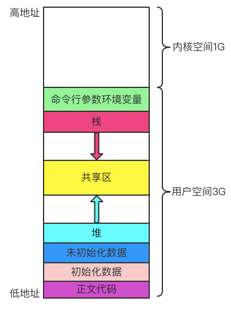

> 线程占有的都是不共享的，其中包括：**`栈`、寄存器、状态、程序计数器**
>
> 线程间共享的有：**`堆`，全局变量，静态变量**
>
> 进程占有的资源有：**地址空间，全局变量，打开的文件，子进程，信号量、账户信息。**
>
> 每一个线程都有一个栈，但是每一个应用程序通常都只有一个堆

### 1. 堆栈（栈Stack）

**栈（stack）又名堆栈是操作系统在`建立某个进程时或者线程`，为这个线程建立的`存储区域`。**

- **内存分配取决于编译器，`用户栈`在程序运行期间可以`动态的扩展和收缩`。**
- 供系统或者操作系统使用，对程序员来说一般是不可见的。
- 和数据结构中的“栈”本质上是不一样的，但是`操作方式`类似于栈。
- 数据从栈中的进出满足`“后进先出”`的规律。
- 栈向`低地址方向`增长，esp（栈指针）指向栈顶元素。

- 不能申请占用过大的内存的局部变量，会导致栈爆掉。如果变量太大，可以考虑放到全局变量区或者使用堆。

栈在程序运行中保存了一个函数调用所需要维护的信息，称为`活动记录`（一个堆栈）包括

- 函数的返回地址，参数

- 临时变量

- 上下文：寄存器

> 一个活动记录用ebp和esp两个寄存器来划定范围，esp始终指向栈顶部，任何指令的执行都会改变esp的值，push stack的时候esp减小，pop stack的时候esp增大。ebp则指向了一个固定位置，表示函数调用的开始。

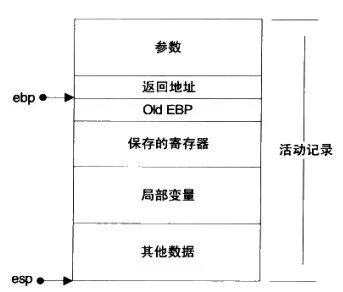 

当调用函数时:

- 把参数按照`从右至左`的顺序压栈（后面复制保证从左至右）

- 当前指令的下一条指令入栈(return address)

- 开始执行函数体（先保存old ebp），再把参数复制一份到局部变量(**此时栈就可以变成从左至右顺序**)

- 当返回函数时：把old ebp读回寄存器，然后从return address开始执行

- **过eax寄存器，函数将返回值存储在eax中，然后调用方读取eax。但是，eax本身只有4个字节，大于4个字节的返回值，则是通过eax存储了一个指针，而实际内容在栈上的其他地方。**

### 2. 堆（heap）

用于动态分配内存，c语言中使用malloc/free进行申请和释放。一般操作给的是一块连续的存储空间，而在操作系统哪里，它只记录它分配空间的`初始地址`和`大小`，当free时将初始地址归入操作系统的空闲空间。

- 内存分配取决于程序员，C/C++可以手动释放该片内存。
- **和数据结构的”堆“完全两回事，没有半点关系，在这里堆的结构更像`链表`。**
- 堆的存储空间是`不连续`的
- 所有的`对象`，包括`数组`的对象都存在堆上。
- 堆内存被`所有的线程`共享。
- `引用类型`总是放在堆中。
- 堆向`高地址`方向增长，内核都维护的变量brk指向堆顶。

### 3. 堆栈的分区

```c
int a = 0;        //全局初始化区
char *p1;       //全局未初始化区
void main()
{
    int b;          //栈
    char s[] = "123";  //栈
    char *p2;       //栈
    char *p3 = "sdfghhj"; //其中，“sdfghhj\0”常量区，p3在栈区
    static int c = 0; //全局区
    p1 = (char*)malloc(10);   //10个字节区域在堆区
    strcpy(p1,"sdfghhj");    //"sdfghhj\0"在常量区，编译器可能会优化p1和p3指向同一块区域

}
```

### 4. 区别

- **栈内存存储的的是`局部变量`，堆内存存储的是`实体`。**
- **堆一般由`程序员`分配释放，栈由`编译器(Compiler)`自动分配释放。**
- **栈内存的更新的速度会更快些（局部变量），堆内存的更新速度相对更慢。**
- **栈内存的访问直接从地址读取数据到寄存器，然后放到目标地址，而堆内存的访问更麻烦，先将分配的地址放到寄存器，在读取地址的值，最后再放到目标文件中，开销更大。**
- **栈内存是连续的空间，堆内存一般情况不是连续的，频繁地开辟空间，释放空间容易产生内存碎片。**
- **堆：操作系统有一个记录`空闲内存地址的链表`，当系统收到程序的申请时，会遍历该链表，寻找第一个空间大于所申请空间的堆结点，然后将该结点从`空闲结点`链表中删除，并将该结点的空间分配给程序，另外，对于大多数系统，会在这块内存空间中的首地址处记录本次分配的大小，这样代码中的delete语句才能正确的释放本内存空间。另外由于找到的堆结点的大小不一定正好等于申请的大小，系统会自动的将多余的那部分重新放入空闲链表中。栈：只要栈的剩余空间大于所申请空间，系统将为程序提供内存，否则将报异常提示栈溢出。**

## 缓冲

- 硬件缓存（cache）

由一种高速寄存器（register）组成，主要解决CPU与RAM之间的速度差问题。

- 数据缓冲区高速缓冲（buffer）

由软件实现的**解决文件系统和物理硬盘之间**的数据同步的一种方法。数据缓冲区高速缓冲是UNIX特有的对数据并发访问的一种控制机制。

> 磁盘机械运行速度大大低于处理机的运行速度；
> 多进程并发运行，少量的磁盘（通道）I/O成为瓶颈；
> 数据访问的随机性，磁盘忙闲不均。
>
> - 建立一个被称为数据缓冲区高速缓冲（简称高速缓冲）的内部数据缓冲区池（buffer pool）来存放要用的数据；
> - 写数据时：把数据尽量多地尽量长时间地保存在缓冲池中延迟写出到磁盘上以备后续进程使用。
> - 读数据时：先在缓冲池中查找已有的数据如没有，再从磁盘读取，并保存在缓冲池中。事先预读数据到缓冲池中。

### 1. 缓冲区首部

**缓冲区池由若干个缓冲区组成，每一个缓冲区又由两部分组成：一个实际存放数据的存储区和一个标识该缓冲区的缓冲区首部。**


```c
struct buf {
	缓冲区标志 标识缓冲区状态
	缓冲区链接指针 向前向后串成链表
	空闲缓冲区链表指针 联结空闲缓冲区
	设备号 标识缓冲区
  块号
  union{ 缓冲区中的数据类型
    数据块
    超级块
    柱面块
    i节点块
  }b_un
  其它控制信息
}
```

### 2. 空闲缓冲池结构

#### （1）最近最少使用（LRU）算法

> - 程序设计采用模块化和层次化结构，尽量避免使用goto语句，程序跳转少，适应“流水线（pipeline）”体系结构的系统；（**如果跳转，下一条指令可能还在硬盘**）
> -  特定时间段内，程序在一个相对集中空间（代码段）内运行，涉及的数据（广义的：文件名、变量、指针和数组等）的个数相对较少；
> - 当前使用过的数据，马上还要使用的可能性最大，较长时间未用过的数据，即将使用的可能性最小。

#### （2）空闲缓冲区链表

**核心维护了一个空闲缓冲区链表，它按照最近被使用的先后次序排列。空闲链表是一个以空闲缓冲区链表头开始的“双向循环链表”。**

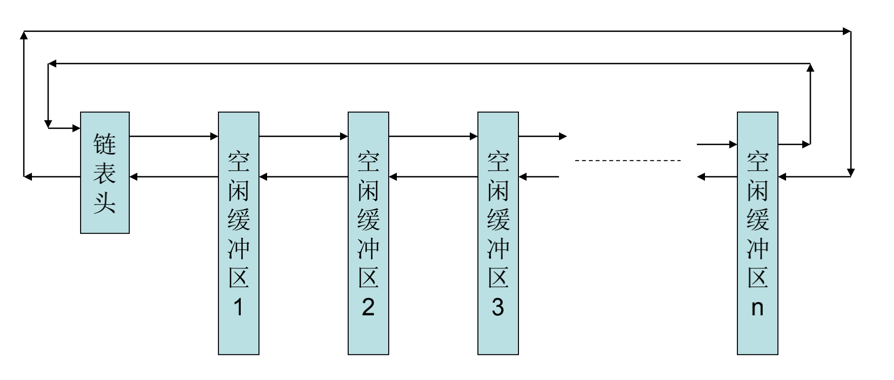

- 取用任意空闲缓冲区：**从空闲缓冲区链表的表头位置取下一个空闲缓冲区，后面的空闲缓冲区依次向前移动。**
- 释放一个空闲缓冲区：**把这个装有数据的空闲缓冲区附加到空闲链表的链尾。只有当该空闲缓冲区所装数据出错时才挂到链头。**
- 取用装有指定内容的空闲缓冲区：**从链表头开始查找，找到后取下使用，用完后放到链尾。**

> 当系统不断从链头取用空闲缓冲区，又把使用过的（装有数据的）缓冲区挂到链尾，一个装有有效数据的缓冲区就会逐渐向链表头移动。**在链表头位置的就是“最近最少使用”的空闲缓冲区。**

#### （3）**空闲缓冲区分类**

系统中共设置了四个空闲缓冲区链表，根据缓冲区的不同用途而把它的放入不同的空闲缓冲区链表中。避免在取用空闲缓冲区时，逐个判断缓冲区中的内容。这四个空闲链表是：

- **0#空闲缓冲区链表——存放文件系统超级块**
- **1#空闲缓冲区链表——存放通常使用的数据块**
- **2#空闲缓冲区链表——存放延迟写、无效数据或错误内容**
- **3#空闲缓冲区链表——存放没有对应存储空间的缓冲区首部**

> 如果某种类型的空闲缓冲区不够用时，核心也从其它空闲缓冲区链表中取用空闲缓冲区。

### 3. 缓冲池结构

当核心需有一个空闲缓冲区时，它根据要装入的数据类型，**从相应的空闲缓冲区链表的表头位置取下一个空闲缓冲区，装入一个磁盘数据块**；根据该数据块所对应的设备号和块号数据**对计算其 hashno（散列、杂凑）值，根据其 hashno 的值放入到相应 hash 链表的链头。**

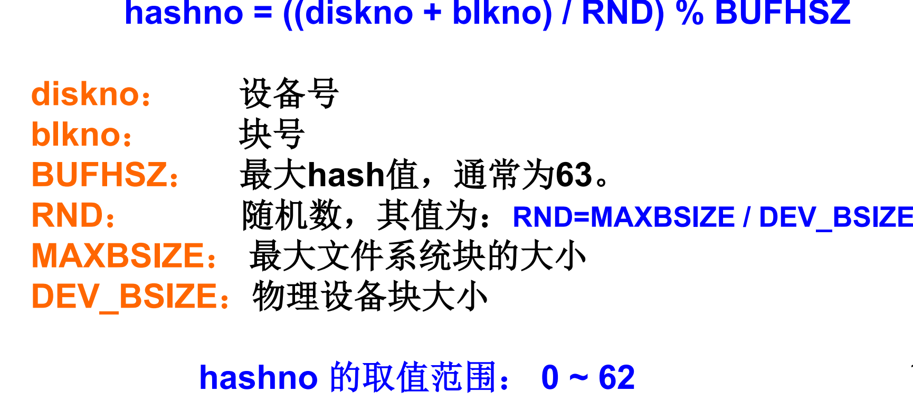

每一个 hash 链表都是一个由链表头指向的双向循环链表，查找某一个指定 hashno 值的缓冲区时，也是从相应的hash链表的表头位置开始向表尾方向进行查找。这 63 个 hash 链表就构成了数据缓冲区高速缓冲的缓冲池，所有的缓冲区都存放在缓冲池中的某一个链表中。

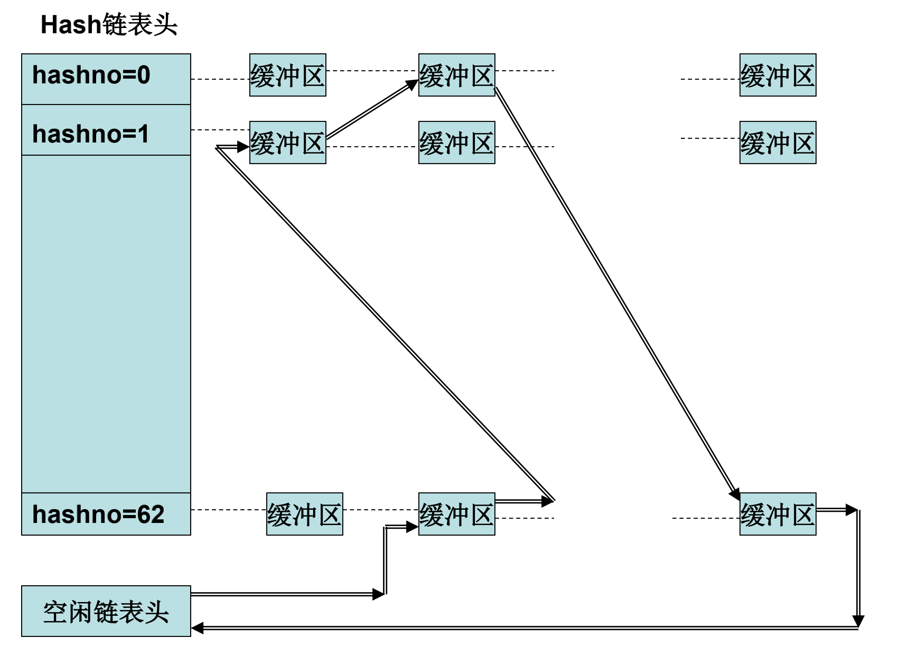

### 4. 缓冲区使用

如果要找特定缓冲区，根据hashno从相应的hash链表的表头处开始逐个向后查找：

- **如果找到，则直接取用，并将其移动到hash链的链头；**
- **如果未找到，则从相应的空闲缓冲区链表的表头处取下一个空闲缓冲区，填入相应数据，重新计算其hashno，并放到新的hash链表的表头；**

**释放缓冲区时，将该缓冲区仍保留在原hash队列中，同时挂接到空闲缓冲区链表的表尾。（同时在两个队列中）**

> **要指定缓冲区** **——** **在hash链表中查找**
>
> **要空闲缓冲区** **——** **在空闲链表中查找**
>
> **一个缓冲区只有当它是空闲状态时，它才同时处在hash链表和空闲链表中。如果不空闲，则它只能处在某一个hash链表中。**
>
> **在空闲缓冲区链表中的缓冲区一定在某个hash链表中；在hash链表中的缓冲区不一定在空闲链中。不存在脱离hash链表的另一个空闲的缓冲区链表。**
>
> **① 一个磁盘数据块在缓冲池中最多只能有一个副本；**
>
> **② 缓冲区与数据块的对应是动态的，LRU数据块将被释放。**

### 5. 缓冲区算法

#### （1）申请一个缓冲区算法getblk

> **①** **该块已在hash队列中，并且缓冲区是空闲的；**
>
> **②hash队列中找不到该块，需从空闲链表中分配一个缓冲区；**
>
> **③hash队列中找不到该块，在从空闲链表中分配一个缓冲区时，发现该空闲缓冲区标记有“延迟写”，核心必须写出缓冲区内容到磁盘上，再重新分配一个空闲缓冲区；**
>
> **④hash队列中找不到该块，并且空闲链表已空；**
>
> **⑤** **该块已在hash队列中，但该缓冲区目前状态为“忙”。**

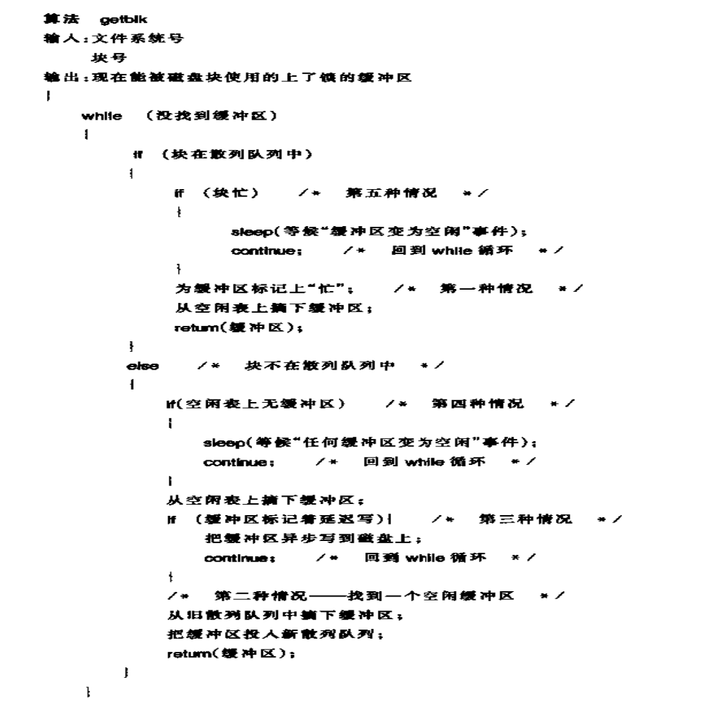

#### （2）释放一个缓冲区算法 brelse

> 唤醒等待缓冲区的所有进程
>
> 提高处理机的执行级别以封锁同级或低级的中断
>
> 将该缓冲区放到空闲队列的尾部（缓冲区有效）或头部（缓冲区无效）
>
> 降低处理机的执行级别以开放中断

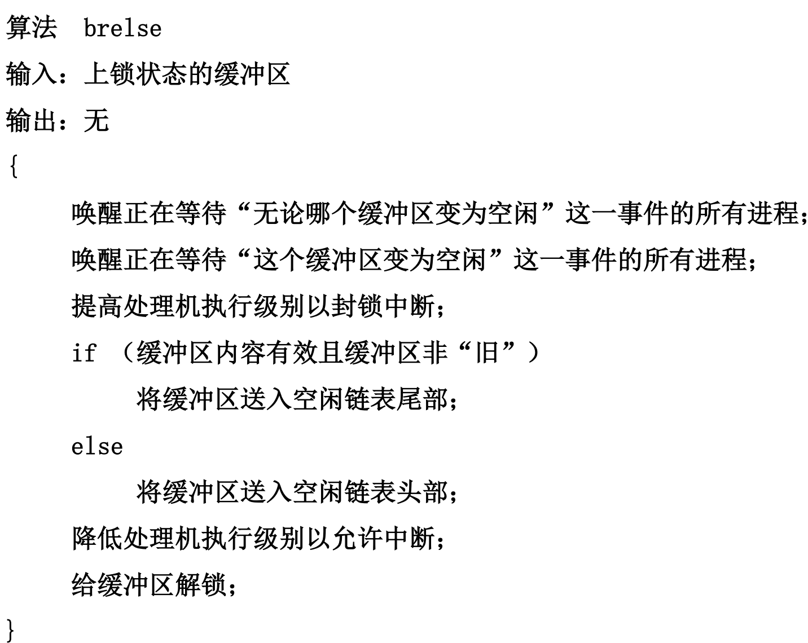

#### （3）**读一个磁盘块** **bread** 

> 由 getblk 算法申请一个可用的缓冲区
>
> 如果缓冲区中的内容有效，则直接返回该缓冲区
>
> 如果缓冲区中的内容无效，则启动磁盘去读所需的数据块
>
> 等待磁盘操作完成后返回

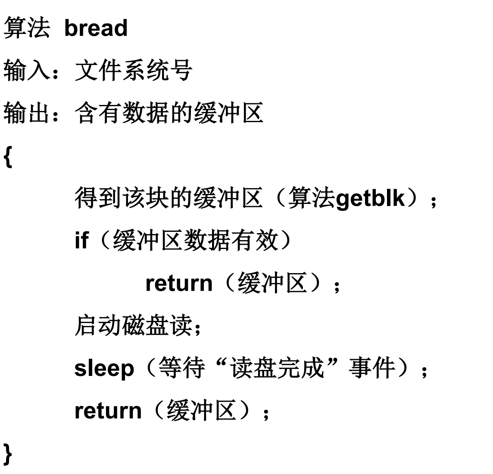

#### （4） 读一个磁盘块并预读另一个磁盘块 breada

预读的前提：程序是在一个有限的空间内运行，程序对数据的访问是可预见的。

预读的命中率：不一定达到100%，但良好的系统结构和算法可使命中率达到较高的水平。

预读的结果：放在缓冲池内，以免需要的时候再去启动磁盘读数据块。

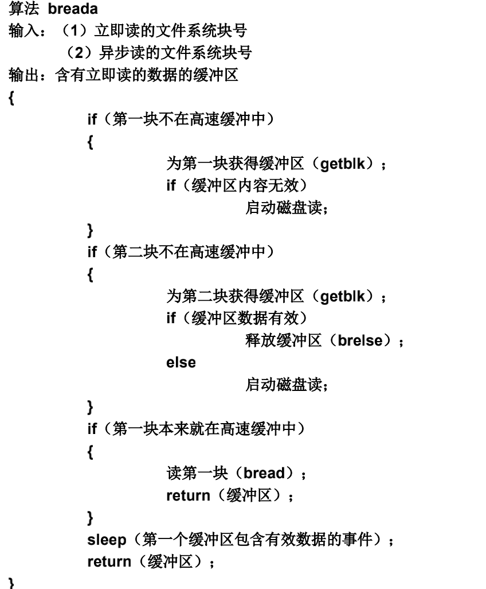

#### （5）写磁盘块 bwrite

如果是“同步写”，则本进程睡眠等待磁盘写操作的完成，磁盘写操作完成后，中断唤醒本进程，本进程释放该缓冲区并返回；

如果是“异步写”，则无需等待磁盘写操作的完成，将缓冲区放到空闲链表的表头，以便随后某个进程申请空闲缓冲区时，将其写到磁盘上去。本进程不再关心该缓冲区实际被写出的时间和结果，而直接返回去作其它事情。

事实上无论是同步写还是异步写，其根本区别在于本进程是否等待磁盘驱动程序完成操作后所发出的中断信号。

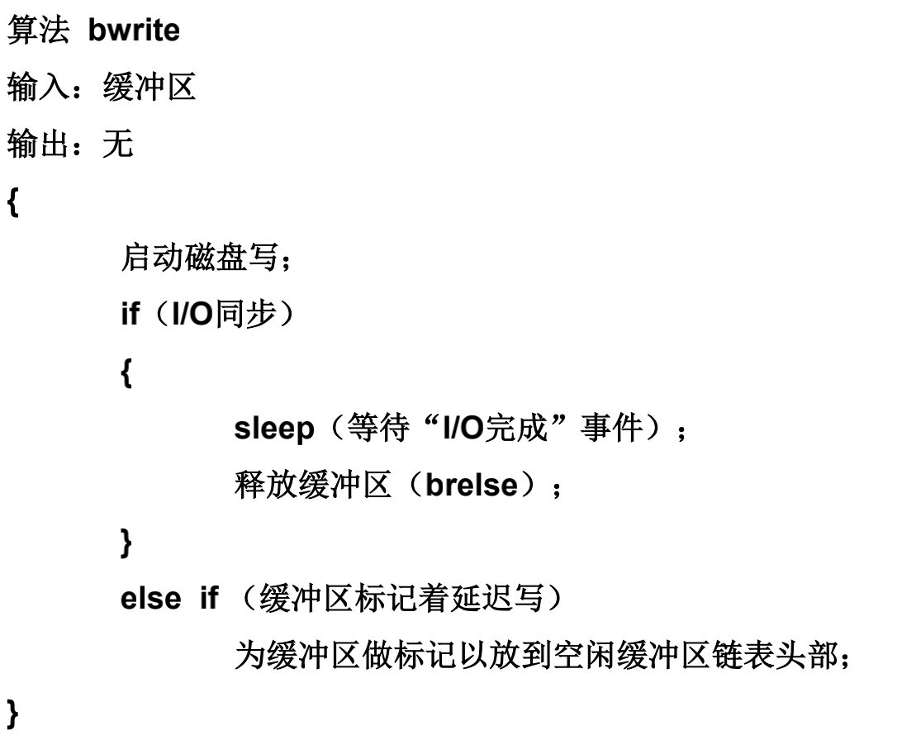